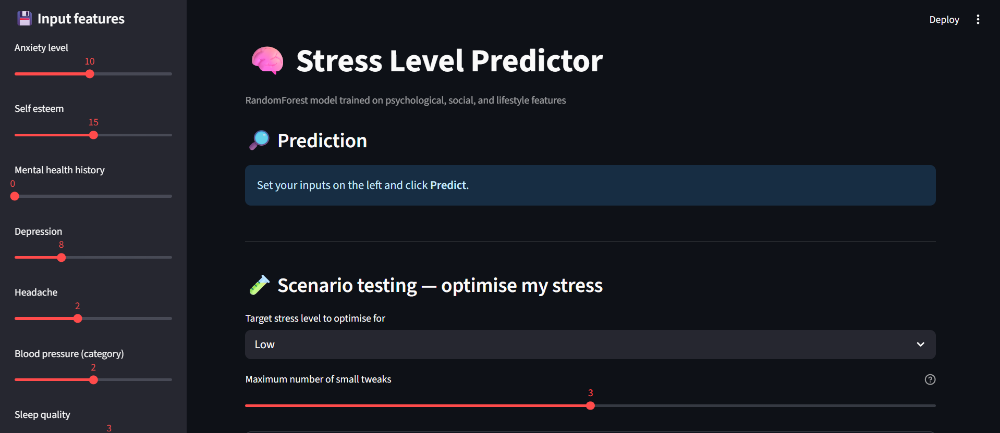
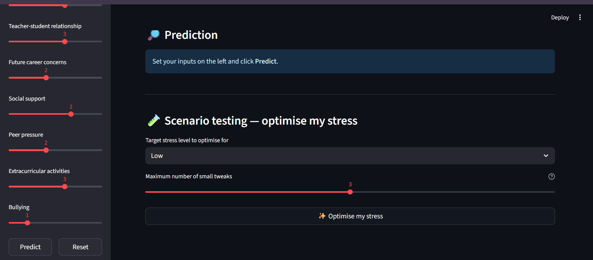
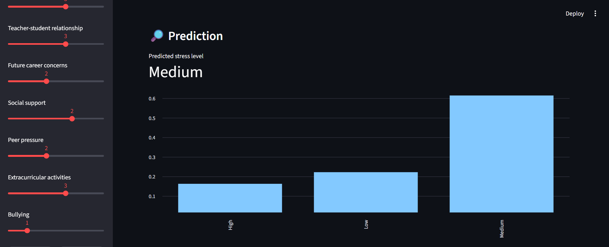
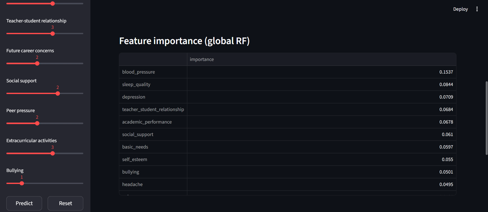
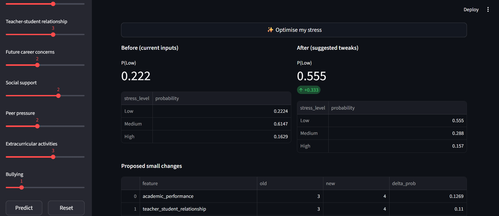
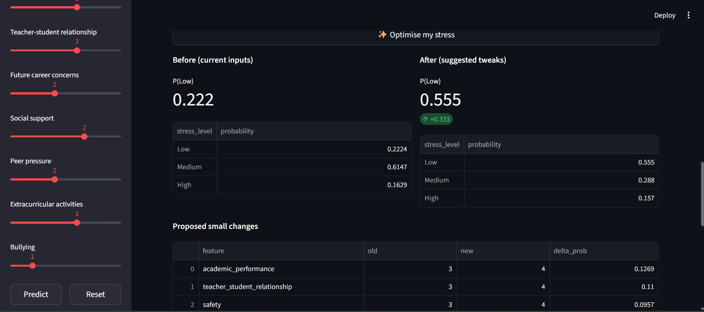

# 🧠 Stress Level Predictor (with Scenario Testing)

An interactive **Streamlit web app** that predicts student **stress levels (Low, Medium, High)** from psychological, social, and lifestyle factors.  
The app also includes a unique **Scenario Testing Optimiser** that suggests small lifestyle/academic tweaks (e.g., better sleep, more social support) and shows how those changes could reduce stress probability.

---

## 🚀 Features
- **Data preprocessing & ML model**
  - RandomForest classifier trained on 1,100+ records  
  - Uses features such as anxiety, depression, sleep quality, peer pressure, social support, etc.  
- **Interactive Prediction**
  - Sliders for all input features  
  - Predicted class + probability distribution bar chart  
- **Explainability**
  - Global feature importances  
- **Scenario Testing Optimiser**
  - Suggests small one-step changes to features  
  - Shows **before vs after** stress probabilities  
  - Option to **reset sliders** to optimised values  

---

## 📸 Screenshots

### 🎛️ Input Features

### 🔍 Prediction

### 🧪 Scenario Testing (Before vs After)

### 📈 Feature Importance

### 📊 Proposed Small Changes

### 🎯 Final Predicted Stress Level

---

## 🛠️ Tech Stack
- **Python 3.10+**
- **Streamlit** (frontend)
- **Scikit-learn** (ML model)
- **Pandas / Numpy** (data handling)
- **Joblib** (model persistence)

---

## 📊 Why this matters

Understanding **why** a model predicts higher stress can help:

- 🎓 **Educators** support students with academic pressure  
- 🧑‍⚕️ **Psychologists** identify high-risk cases early  
- 🏢 **Organisations** design better workplace wellness interventions  

---

⚠️ **Disclaimer:**  
This project is developed for **educational purposes only**.  
It is **not a substitute** for professional medical or psychological advice.  
If you are experiencing stress or mental health challenges, please consult a qualified healthcare professional.
